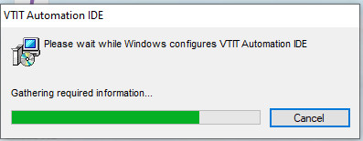
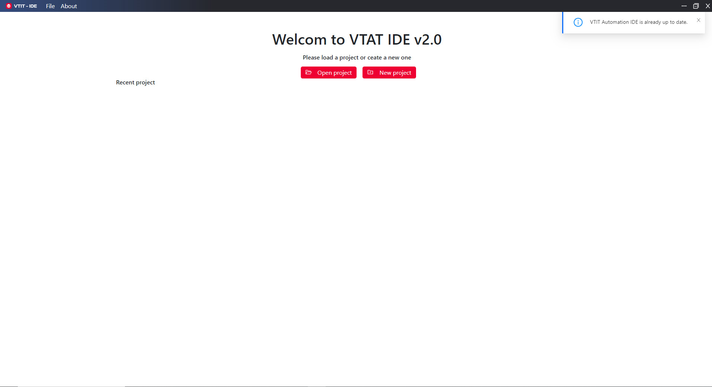

# 2. Cài đặt IDE

IDE là phần mềm được cài đặt trên máy tính của người dùng (Tester) để thực hiện các thao tác viết testcase automation và chạy thử nghiệm các testcase được viết.

Để cài đặt IDE ta thực hiện các bước sau:

### Bước 1: Truy cập link download tại một trong các địa chỉ sau

* Windows: [Tải xuống](https://bucket.viettelsoftware.com/automation-pkg/releases/win32/x64/vtit-automation-ide-2.1.229.msi)
* MacOs - X64: [Tải xuống](https://bucket.viettelsoftware.com/automation-pkg/releases/darwin/x64/vtit-automation-ide-2.1.229.dmg)
* MacOs - arm64: [Tải xuống](https://bucket.viettelsoftware.com/automation-pkg/releases/darwin/arm64/vtit-automation-ide-2.1.229.dmg)

### Bước 2: Chạy file cài đặt vừa được tải về và làm theo hướng dẫn ở từng màn hình cài đặt.

<figure><figcaption>
Run File cài đặt
</figcaption></figure>

_Với máy MAC thì cần cấp quyền cái đặt ứng dụng vào đường dẫn_

setting > privacy & security> security

Trong mục **Alloy Applications downloaded from**

thì chọn **Appstore and identified developers**

<figure><figcaption></figcaption></figure>

### Bước 3: Khởi động IDE

<figure><figcaption>
Cài đặt thành công
</figcaption></figure>
