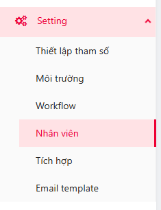

# 9. Hướng dẫn cài đặt test management

## Chuẩn bị&#x20;

* Server triển khai cần được cài đặt docker  theo hướng dẫn : [Hướng dẫn cài đặt docker, docker-compose](5.-cai-dat-docker-docker-compose.md)
* Đã có sẵn MariaDB hoặc các SQL khác theo hướng dẫn: [Hướng dẫn cài đặt MariaDB ](10.-huong-dan-cai-dat-mariadb.md)
* Đã cài đặt sẵn Keycloak theo hướng dẫn: Hướng[ dẫn cài đặt Keycloak](11.-huong-dan-cai-dat-keycloak.md)
* Đã cài đặt sẵn Minio theo hướng dẫn: [Hướng dẫn cài đặt Minio](12.-huong-dan-cai-dat-minio.md)&#x20;

## Bước 1. Download các image FE, AUTOSERVICE, NOTIFY, GATEWAY

* Image Autoservice: [https://drive.google.com/file/d/1t7MKR0g8d\_lfiSWg4QryodYyocQV3eng/view?usp=drive\_link](https://drive.google.com/file/d/1t7MKR0g8d_lfiSWg4QryodYyocQV3eng/view?usp=drive_link)
* Image Notify: [https://drive.google.com/file/d/1qlgBcb5dfP1zdhz-QbQ0p1EeP\_DVnhZT/view?usp=drive\_link](https://drive.google.com/file/d/1qlgBcb5dfP1zdhz-QbQ0p1EeP_DVnhZT/view?usp=drive_link)
* Image Gateway: [https://drive.google.com/file/d/1TQpKnaZYu7Q1Vp3ctotZMztce1UFyAJk/view?usp=drive\_link](https://drive.google.com/file/d/1TQpKnaZYu7Q1Vp3ctotZMztce1UFyAJk/view?usp=drive_link)
* Image Fe: Sẽ build khi cài đặt để phù hợp với cấu hình

## Bước 2.    Chuẩn bị  file cài đặt FE, AUTOSERVICE, NOTIFY, GATEWAY

```
cd /${path} lưu trữ các image của FE, AUTOSERVICE, NOTIFY, GATEWAY
```

Download và sửa file config:

* Sửa file cấu hình application-auto.properties download từ đường link: [https://drive.google.com/file/d/1Yz2i4IoQ9zsd59BUYQ7PKPnYW\_zUmBIs/view?usp=drive\_link](https://drive.google.com/file/d/1Yz2i4IoQ9zsd59BUYQ7PKPnYW_zUmBIs/view?usp=drive_link)
* Sửa file cấu hình application-notify.properties download từ đường link:[https://drive.google.com/file/d/1uVMb9AdR2mFionWqvDpLGIM7SlXDxHjN/view?usp=drive\_link](https://drive.google.com/file/d/1uVMb9AdR2mFionWqvDpLGIM7SlXDxHjN/view?usp=drive_link)
* Sửa file cấu hình autotest-gateway.yaml download từ đường link: [https://drive.google.com/file/d/1Di8ajqNY0Oo5nWcVXPRz5ZnhEFQb-mtI/view?usp=drive\_link](https://drive.google.com/file/d/1Di8ajqNY0Oo5nWcVXPRz5ZnhEFQb-mtI/view?usp=drive_link)

```sh
docker load -i autotest-be.tar
docker load -i gateway.tar
docker load -i notify.tar
```

## Bước 3.  Cài đặt FE, AUTOSERVICE, NOTIFY, GATEWAY

```sh
docker run -d --log-opt max-size=10m --log-opt max-file=2 -p 8080:8080 -v /${path}/application-auto.properties:/${path}/application-auto.properties --name autoservice autotest-be:prod
docker run -d --log-opt max-size=10m --log-opt max-file=2 -p 8083:8083 -v /${path}/application-notify.properties:/java-app/config/application-notify.properties --name notifyservice notify-auto:prod 
docker run -d --log-opt max-size=10m --log-opt max-file=2 -p 8888:8888 -v /${path}/autotest-gateway.yaml:/java-app/config/autotest-gateway.yaml --name gateway gateway-auto:prod
docker run -d --log-opt max-size=10m --log-opt max-file=2 -p 8081:80 --name fe fe:prod
```

## Bước 4. Kiểm tra cài đặt

Mở trình duyệt

Kiểm tra FE bằng http://${ip}:8081

Kiểm tra BE bằng http://${ip}:8888/webjars/swagger-ui/index.html

## Hướng dẫn sử dụng chức năng đăng nhập

### 1.1.       Tạo user đăng nhập hệ thống

\-     NSD đăng nhập hệ thống Keycloak với account admin được cấp

<figure><figcaption></figcaption></figure>

NSD chọn realms được cấp, chọn Users

<figure><figcaption></figcaption></figure>

NSD tạo user trong keycloak sau khi ấn Add user

<figure><figcaption></figcaption></figure>

### 1.2.       Hướng dẫn đăng nhập hệ thống

\-          NSD đăng nhập vào hệ thống theo đường dẫn: http://auto.viettelsoftware.com:8083/

·         Tài khoản đăng nhập: Tài khoản đăng nhập email.

·         Mật khẩu: Mật khẩu SSO.

<figure><figcaption></figcaption></figure>


#### 1.3.  Hướng dẫn tạo nhân viên trên TM

* Sau khi đăng nhập vào hệ thống TM bằng tài khoản admin
* Trên menu chọn menu Nhân viên trong Setting&#x20;
*

    <figure><figcaption></figcaption></figure>
* Sau đó bấm Thêm mới&#x20;
*

    <figure><figcaption></figcaption></figure>
* Điền đầy đủ thông tin&#x20;
